# Variable Relationship Map

Date: 2026-06-03
Status: Current implemented production, retail demand, and base-price relationships are documented explicitly. Older template sections below remain for deferred systems.
Stable terminology, constants, parameters, and variable descriptions live in [CONTEXT.md](CONTEXT.md). This document describes **how** variables should relate to each other through gameflow once those terms exist.

## Current implemented baseline (2026-06-03)

The runtime currently has a concrete multi-building production and retail-preview chain:

- `GameLoopState.tick` increments by `+1` each manual tick.
- `Building(type, size, currentStaff, recipeType)` resolves to `ProductionRecipe` through `RECIPE_BY_TYPE`.
- Building creation uses `DEFAULT_RECIPE_BY_BUILDING_TYPE` and recipe switching is bounded by `AVAILABLE_RECIPE_TYPES_BY_BUILDING_TYPE`.
- Recipe change resets `currentRecipeWorkProgress` to `0`.
- `Building.size` drives staffing capacity (`maxStaff`) through `calculateMaxStaff(type, size)`.
- Manual staffing can be set from `0` up to `maxStaff`.
- Decreasing size does not auto-reduce `currentStaff`, so `currentStaff` may be above `maxStaff` temporarily.
- Recipe execution consumes required inputs at cycle start, then adds outputs at cycle completion.
- Recipes may require multiple input resources (for example cake requires flour and sugar).
- `RESOURCE_DEFINITIONS` is the source of truth for `ResourceType` and resource metadata.
- `water` is marked `isCycleDependentResource` and uses `fixedBaseCost = 16`.
- Intrinsic `baseResourceCost` is derived from the cheapest producing recipe path, except cycle-dependent resources use `fixedBaseCost`.
- `baseCityPrice` is derived as `baseResourceCost * (1 + city.wealth)`.
- `baseCityDemand` is derived as `city.population * city.wealth * BASE_CONSUMPTION_BY_RESOURCE[resource]`.
- The current city marketplace is a consumer retail flow where player offers compete against `Average NPC`, `Follower NPC`, and `Local Suppliers` per resource.
- The active marketplace city is player-selected and resolved each manual tick when valid offers are listed.
- Offer resolution currently supports one player seller, strategy-driven NPC sellers, and `Local Suppliers` per listed resource.
- `Average NPC` offered quantity is `Math.round(baseCityDemand * AVERAGE_NPC_DEMAND_SHARE)`.
- `Average NPC` offer price is the average of Local Supplier base city price and previous tick player offer price for the same resource (fallback to Local Supplier price when no previous player offer exists), capped at Local Supplier base city price.
- `Follower NPC` offered quantity is the smoothed recent player sold quantity for the same resource, with a minimum quantity floor.
- `Follower NPC` offer price is the smoothed recent player offer price for the same resource, adjusted by `FOLLOWER_NPC_PRICE_ADJUSTMENT_MULTIPLIER` up or down depending on whether recent follower sell-through is above or below `FOLLOWER_NPC_LOW_SELL_THROUGH_THRESHOLD`.
- Retail demand flow follows explicit phases: base demand -> cross-resource substitution -> below-average-price demand creation -> random demand shocks -> seller allocation.
- Seller demand split uses sensitivity-weighted retailer shares based on `INTER_RETAILER_SENSITIVITY[resource]`.
- Random demand shocks run per resource with chance `DEMAND_SHOCK_CHANCE`, target one seller, and apply either `DEMAND_SHOCK_NEGATIVE_MULTIPLIER` or `DEMAND_SHOCK_POSITIVE_MULTIPLIER` before final seller allocation.
- Local Suppliers are treated as effectively unlimited offered quantity for fallback fulfillment.
- Marketplace demand and sales are resolved in whole units (`Math.round` demand/share; floor listed quantity and available inventory).
- If rounded demand is below `0.5` (i.e., rounds to `0`), no sale occurs for that resource.
- `GameLoopState.money` starts at `1000` and increases from player marketplace sales.
- `GameLoopState.lastMarketplaceTick` stores previous tick offer/sales results for listed resources.
- `GameLoopState.marketplaceTickHistory` stores bounded recent marketplace tick results for smoothing-based NPC behavior.

Important current constraints:

- `size` and `currentStaff` do not directly multiply output amount; they influence effective work and completion speed.
- `baseResourceCost` remains a reference value; it is not directly transacted.
- `baseCityPrice` is used as Local Supplier offer price baseline in current retail resolution.
- Marketplace sales use whole-unit allocation only; no fractional unit sales are recorded.
- Cross-resource substitution and demand creation are now active only inside listed marketplace resources and use bounded constants (`SUBSTITUTION_DEVIATION_THRESHOLD`, `SUBSTITUTION_DAMPENING`, demand-creation caps/dampening).
- Price subsidies, product quality, education-based quality, and city-adjusted wage calculations are planned later.

Prestige or progression event sources may be inventoried separately when that subsystem is implemented (e.g. under `docs/superpowers/completed/`).

## 1) Purpose

This map answers:

- Which variables are produced at each stage of gameplay?
- Which subsystems consume each variable later (UI, economy, contracts, highscores, achievements)?
- Which global progression overlays (weather, research, prestige, ownership/finance rules) feed into production and market outcomes?

When adding a new variable, update this map **and** `CONTEXT.md` in the same change.

## 3) Top-Level Gameflow

### 3.1 Current concrete loop (implemented)

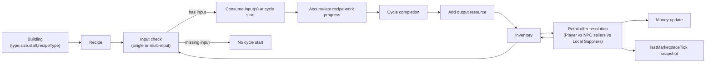

Current meaning:

- Building selects recipe execution context.
- Recipe defines required inputs, output resource, and work required.
- Inventory provides required inputs when a cycle starts.
- Output is added only when recipe work reaches completion.
- Inventory is the persisted sink and source for recipe chaining.
- After production each manual tick, retail resolution runs for listed offers in the selected marketplace city.
- Retail resolution currently runs in steps: substitution and demand creation adjust per-resource demand, random shocks adjust one seller target when triggered, then sensitivity-weighted seller allocation applies caps and whole-unit settlement.
- Tick results persist a seller-level market snapshot in `lastMarketplaceTick` and append to bounded `marketplaceTickHistory` for recent NPC smoothing.

### 3.2 Expanded target loop (template)

Replace node labels when domain phases are named. Keep the same dependency idea: setup -> ongoing production -> transformation -> inventory -> sales/markets -> history/progression.

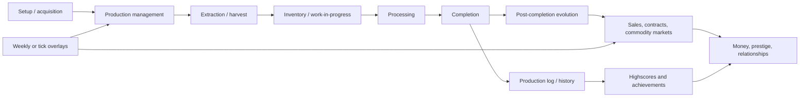

## 4) Main Variable Groups

Fill the “Produces” column when `CONTEXT.md` defines concrete variables.

| Group | Produced from | Produces (typical) |
|---|---|---|
| Site / facility factors | World generation, map choice, facility state | Suitability, static modifiers, contract eligibility |
| Intrinsic resource traits | Resource type constants | Base yields, risk sensitivity, identity bias |
| Identity / anchor layer | Site factors, traits, early process choices | Persisted compact identity used downstream |
| Process controls | Player actions during production and processing | Anchor deltas, characteristic deltas, feature/risk state |
| Quality layer A | Characteristics + identity-adjusted targets | `<qualityIndexA>` (player-facing channel balance) |
| Quality layer B | Identity, characteristics, features, time | `<qualityIndexB>` (second axis if design needs it) |
| Lifecycle modifiers | Features, time in storage, degradation, prestige | Current quality, price, risk |
| Overlay layer | Weather, economy phase, forecast | Production deviations, market pressure, UI context |
| Market layer | Product state, economy, relationships, research | Orders, contracts, commodity trades, revenue |
| Ownership layer | Staff roles, profit, company value | Wage rules, distributions, buyout or share seams |
| Outcome metrics | Quality layers, modifiers, markets | Aggregate score, price, contract validity, history |

## 5) Relationship Invariants

These rules should hold regardless of final variable names:

- **Site + trait identity** is largely fixed at the first major boundary (extraction/harvest/completion of raw lot). Later steps refine, not silently replace, that identity unless design explicitly allows retcon.
- **Process controls** modify identity through anchors, characteristics, features, or explicit snapshots — not through hidden unrelated side effects.
- **Multiple quality layers** stay distinct: document what each layer scores (e.g. physical balance vs flavor profile vs site static value).
- **Static/site quality** affects price and contracts as site or asset quality; it is not the same signal as product taste/quality unless design explicitly merges them.
- **Sales-channel or research unlocks** change access and pricing opportunities; they are not substitutes for quality formulas.
- **Overlays** (weather, economy) apply as explicit deviations to production or markets; do not bury them inside aggregate score math without documenting it.
- **Commodity / bulk markets** are overlays: they may read product or batch state but must not mutate historical snapshots.
- **Ownership/finance layers** affect cash flow and constraints; they do not replace archived share-market or public-company designs unless that runtime is active.
- **Completion snapshots** are the historical source for logs, highscores, and achievement checks tied to a finished unit.
- **Current inventory values** may evolve after completion; **historical snapshots must not drift**.
- **Research unlocks and permanent effects** alter upstream inputs or gates; they should not bypass documented quality computation layers.
- **Prestige (if used)** should be written through a single ledger API with explicit type, source id, decay rules, and metadata — document creators when adding write paths.

### 5.1 Progression Overlay Invariants

- Research gates control **option availability** and scaling boundaries, not score-formula shortcuts.
- Unlock-based gates should list what they affect (planting, methods, caps, contract channels, market access).
- Permanent research effects aggregate from completed research and apply through **named domain services**, not scattered in UI.
- New permanent-effect kinds should follow the same explicit, auditable pattern as existing ones.

## 6) Subsystem Diagrams

Replace placeholder labels with `CONTEXT.md` terms. Keep subgraph boundaries when implementing.

### 6.0 Building capacity and production mapping (current)

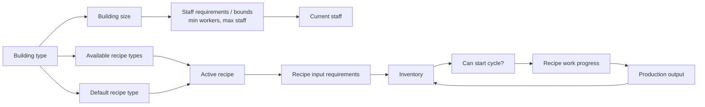

Current implementation note:

- Staff and size define staffing bounds and influence effective work speed through efficiency.

### 6.0.1 Current recipe chains: food and utility water

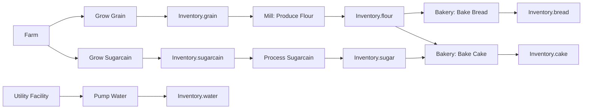

Food chain note:

- Bread path is fully in-chain: `grain -> flour -> bread`.
- Cake path is fully in-chain: `grain -> flour`, `sugarcain -> sugar`, then `flour + sugar -> cake`.
- Water is currently a no-input utility recipe and a cycle-dependent resource cost anchor.

### 6.0.2 Retail demand and base price flow (current)

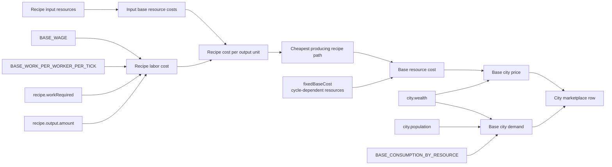

Current pricing formulas:

- `baseResourceCost(resource)` is the cheapest recursive recipe cost unless `resource.isCycleDependentResource` is true.
- `baseCityPrice(resource, city) = baseResourceCost(resource) * (1 + city.wealth)`.
- `baseCityDemand(resource, city) = city.population * city.wealth * BASE_CONSUMPTION_BY_RESOURCE[resource]`.
- `substitutionAdjustedDemand(resource) = baseDemand - substitutionLosses + substitutionGains` using cross-level elasticity and relative price-ratio deviation against base city price ratios.
- `createdDemand(resource)` is added when one or more seller prices are below that resource average seller price, bounded by demand-creation multiplier cap and dampening.
- `finalDemand(resource) = substitutionAdjustedDemand + createdDemand`.
- `averageNpcOfferedQuantity(resource) = Math.round(baseCityDemand(resource, city) * AVERAGE_NPC_DEMAND_SHARE)`.
- `averageNpcPrice(resource) = min(baseCityPrice(resource, city), (baseCityPrice(resource, city) + lastTickPlayerPrice(resource)) / 2)` when last tick exists, otherwise `baseCityPrice(resource, city)`.
- `followerNpcOfferedQuantity(resource) = max(FOLLOWER_NPC_MIN_QUANTITY_FLOOR, round(smoothedRecentPlayerSoldQuantity(resource)))`.
- `followerNpcBasePrice(resource) = smoothedRecentPlayerOfferPrice(resource)` over the bounded recent marketplace tick window.
- `followerNpcPrice(resource) = followerNpcBasePrice(resource) * (1 +/- FOLLOWER_NPC_PRICE_ADJUSTMENT_MULTIPLIER)` depending on whether follower sell-through is below or above `FOLLOWER_NPC_LOW_SELL_THROUGH_THRESHOLD` over the same smoothing window.
- `averageSellerPrice(resource) = mean(activeSellerPrices(resource))` across player, active NPC sellers, and Local Suppliers.
- `sellerWeight(resource, seller) = (averageSellerPrice / sellerPrice) ^ INTER_RETAILER_SENSITIVITY[resource]`.
- `demandShock(resource)` may target one seller with multiplier (`0.85` or `1.15` default) and redistributes the demand delta across remaining sellers before rounding targets.
- `sellerTargetUnits(resource, seller) = floor(shockAdjustedSellerRawDemand)` after optional per-seller +/- shock redistribution and per-seller random share jitter.
- `roundedDemand(resource) = Math.round(finalDemand(resource))`.
- `playerSoldUnits(resource) = min(playerTargetUnits, floor(listedQuantity), floor(availableInventory), remainingDemand)`.
- `npcSoldUnits(resource, npcSeller) = min(npcTargetUnits, npcOfferedQuantity, remainingDemand)` for each active NPC seller in seller-order allocation.
- `localSupplierSoldUnits(resource) = remainingDemandAfterPlayerAndNpcSellers`.
- `earnedMoney = Σ(playerSoldUnits(resource) * playerOfferPrice(resource))` across listed resources.
- Second-pass demand modifiers (price subsidies, product quality) are planned later and do not affect current demand in the current loop.

### 6.1 Site, Resource, and First Boundary Identity

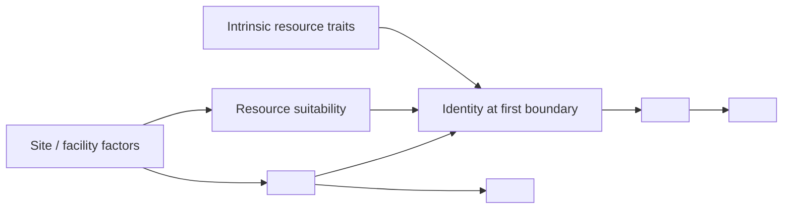

### 6.2 Process Controls and Transformation

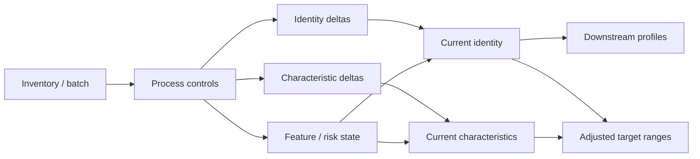

### 6.3 Quality Layer A (example: structure-like balance)

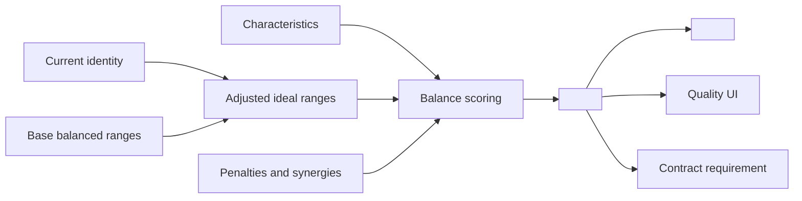

### 6.4 Quality Layer B (example: profile / wheel)

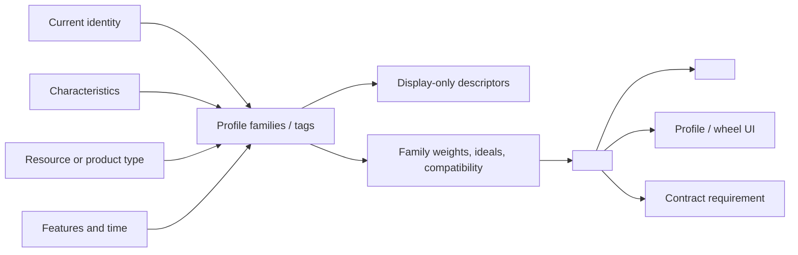

### 6.5 Score, Price, and Market Outcomes

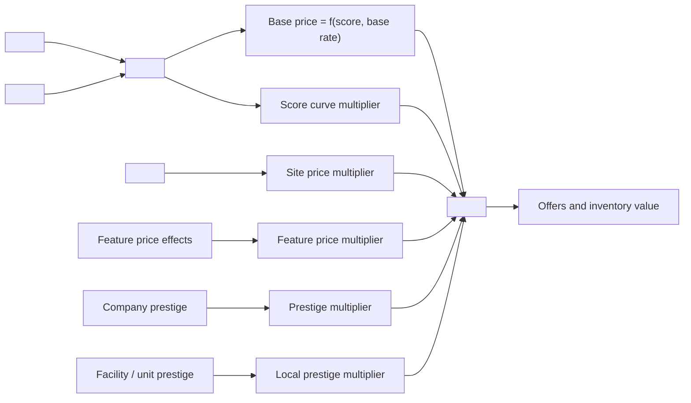

### 6.6 Snapshots, History, and Progression

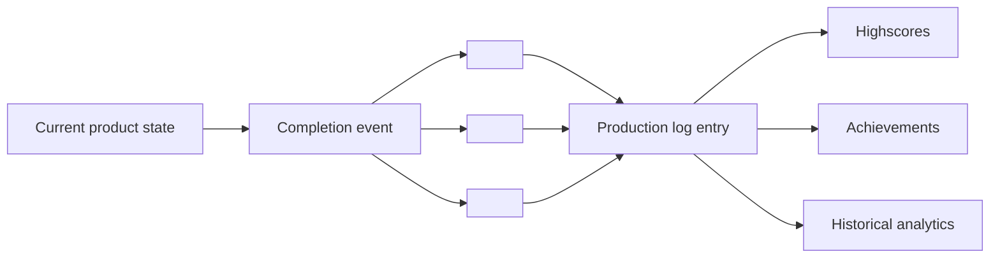

### 6.7 Prestige Event Flow (when implemented)

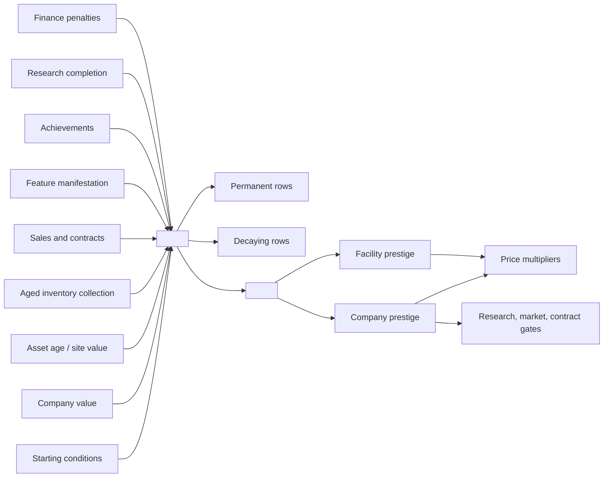

### 6.8 Overlay and Finance Flow (when implemented)

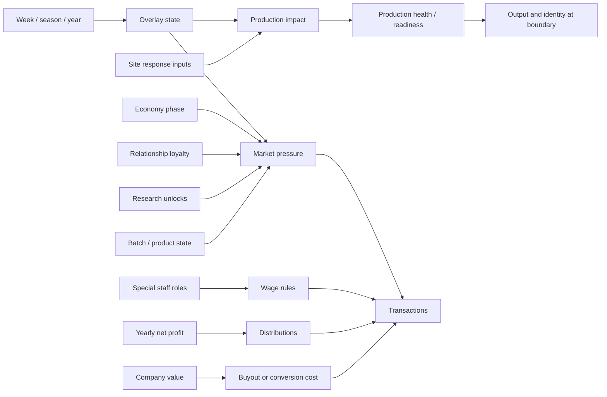

## 7) Contract Relationships

Deferred: add rows when contract requirement types exist.

| Contract requirement | Source variable | Notes |
|---|---|---|
| `<qualityRequirementA>` | Current `<qualityIndexA>` | Validates layer A only. |
| `<qualityRequirementB>` | Current `<qualityIndexB>` | Validates layer B only. |
| `<siteValueRequirement>` | Source facility `<siteValue>` | Absolute or normalized per design. |
| `<locationRequirement>` | Facility or origin fields | Region, biome, license, etc. |
| `<resourceTypeRequirement>` | Batch resource / product type | Type and category gates. |
| `<characteristicMin/Max/Deviation>` | Current characteristics | Channel thresholds or distance. |

## 8) Snapshot Relationship Rules

| Event | Snapshot fields (examples) | Consumers |
|---|---|---|
| First boundary | `<siteModifier@b1>`, `<qualityA@b1>`, `<qualityB@b1>` | UI comparison, batch history, debugging early decisions |
| Completion | Quality, site modifier, aggregate score at completion | Production log, highscores, achievements, analytics |
| Log insertion | Persisted fields on log row | Stats, achievements, long-term history |

Rule: name snapshots with explicit timing (`@harvest`, `@completion`, `@sale`) in code and `CONTEXT.md`.

## 9) UI Relationship Surfaces

Map each UI surface to which relationships it must explain (not just display a number).

| UI surface | Relationship shown |
|---|---|
| Product / batch overview | Current score, price, snapshot comparison across boundaries |
| Quality layer A tab | Channels, adjusted ranges, penalties, synergies |
| Quality layer B tab | Profile families, descriptors, weights and reasons |
| Site / facility tab | Inputs behind site modifier |
| Origins / changelog tab | Characteristic changes by source |
| Production log and analytics | Completion snapshots and trends |
| Overlay center | Current overlay, per-site impact, forecast if any |
| City marketplace | Consumer retail demand, base city price Local Supplier baseline, player listed quantity/price, previous tick seller-level sold units, and per-resource shock status/details |
| Market modals | Price/limit factors, economy/overlay pressure, loyalty |
| Finance ownership panel | Special roles, distributions, conversion costs |

## 10) Implementation Checkpoints

Use as a checklist when wiring a new variable group. Replace placeholders with real names.

| Area | Verify |
|---|---|
| Identity model | Runtime and DB accept only documented keys; unknown keys ignored. |
| Quality layers | Each index has documented inputs, weights, and UI breakdown reasons. |
| Aggregate score | Formula documented; inputs listed in `CONTEXT.md`. |
| Production log | Uses completion snapshots for historical score fields. |
| Achievements | Threshold checks use persisted log scores; no silent fallbacks. |
| Contracts | Separate requirement types for distinct signals (do not overload one field). |
| Overlay integration | Bounded deviations via dedicated services; exposed in UI. |
| City retail marketplace | Keep `baseResourceCost`, `baseCityPrice`, and `baseCityDemand` separate; enforce whole-unit sales; preserve `lastMarketplaceTick` seller snapshot integrity. |
| Markets | Bulk/seasonal channels documented; research scaling explicit. |
| Ownership slice | Active rules documented separately from deferred share-market runtime. |
| Display-only data | Descriptors or tags marked display-only until gameplay consumes them. |

## 11) Main Game Variable Relationship Matrix

Fill each row when a game phase is defined. “Player-visible effect” should be one sentence a designer can sanity-check.

| Game phase | Player / state inputs | Main variables produced | Main downstream consumers | Player-visible effect |
|---|---|---|---|---|
| Setup / acquisition | Location, facility choice, starting package | Site factors, eligibility | Suitability, contracts, modifiers | Starting position shapes what you can produce and sell. |
| Overlay tick | Season, calendar, forecast | Overlay state | Production readiness, markets, UI | External conditions shift outlook without rewriting history. |
| Maintenance | Upkeep actions, capacity, health | Updated site factors | Yield, identity bias, modifiers | Maintenance improves output and reduces penalties. |
| Resource identity | Type constants, planted or assigned resource | Intrinsic traits | Identity, characteristics, risk | Resource choice changes style, risk, and buyer fit. |
| First boundary | Timing, site state, traits | Identity, boundary snapshots, batch record | Processing, quality layers | Timing freezes starting identity of the lot. |
| Processing step 1..n | Methods, options, progress | Identity/characteristic deltas, features | Quality layers, completion readiness | Choices push style and risk. |
| Completion | Current state | Completion snapshots, log row | Highscores, achievements, history | Completion freezes public record; inventory may still evolve. |
| Post-completion | Features, time, degradation | Current quality, price, score | Cellar UI, live contract checks | Value can change after completion for live play. |
| Sales / contracts | Requirements, relationships, context | Validity, orders, revenue | Money, prestige, relationships | Market evaluates documented variables. |
| Commodity market | Batch state, market rows, overlays | Prices, limits, loyalty | Cash, inventory, gates | Liquidity outside direct unit sales. |
| Ownership / finance | Roles, profit, company value | Wages, distributions, conversions | Cash flow, finance UI | Early survival vs later conversion tradeoffs. |
| Progression | Log, sales, assets | Achievements, prestige events | Gates, reputation, opportunities | History feeds long-term progression. |

## 12) Main Variable Flow Display

Consolidated view — update labels when `CONTEXT.md` stabilizes.

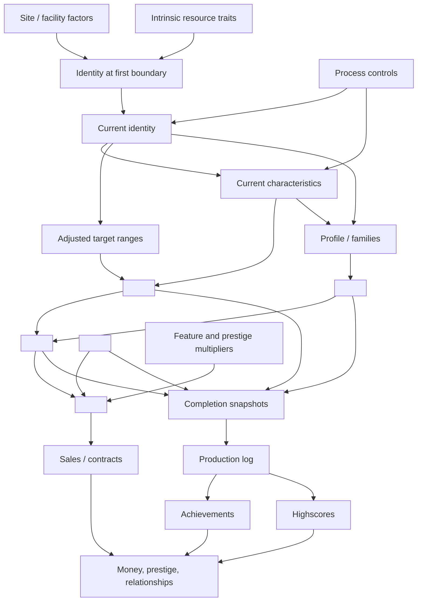

## 13) Remaining Alignment Work

- Route research permanent effects through named domain services so modifier origins stay auditable.
- Keep research benefit copy aligned with implementation (`unlocks` / `permanentEffects` authoritative over flavor text).
- Keep identity parsing strict: unknown keys ignored; new logic targets only the documented compact model.
- When adding prestige write paths, update any prestige source inventory doc in the same PR.
- Keep deferred systems (e.g. share market, descriptor-level scoring) framed as inactive until runtime is wired.
- When overlay mechanics expand (events, mitigation, research upgrades), update §6.8 and implementation checkpoints.
- When commodity market unlocks change, update §4 market row and contract table.
- Before wiring display-only descriptors into outcomes, update this map and `CONTEXT.md` first.

## Related docs

| Need | Document |
|---|---|
| Domain glossary (names and definitions) | [CONTEXT.md](CONTEXT.md) |
| Module ownership and paths | [docs/PROJECT_INFO.md](PROJECT_INFO.md) |
| What is actually implemented | [docs/AIdocs/AIDescriptions_coregame.md](AIdocs/AIDescriptions_coregame.md) |
