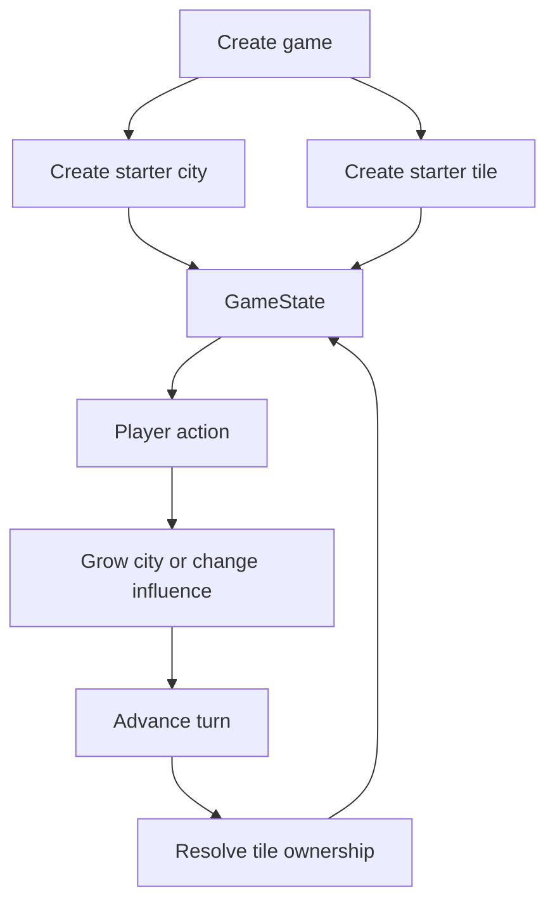
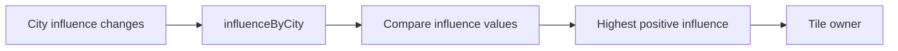
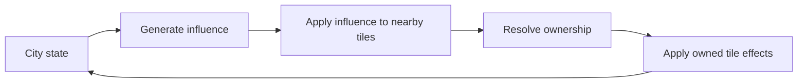
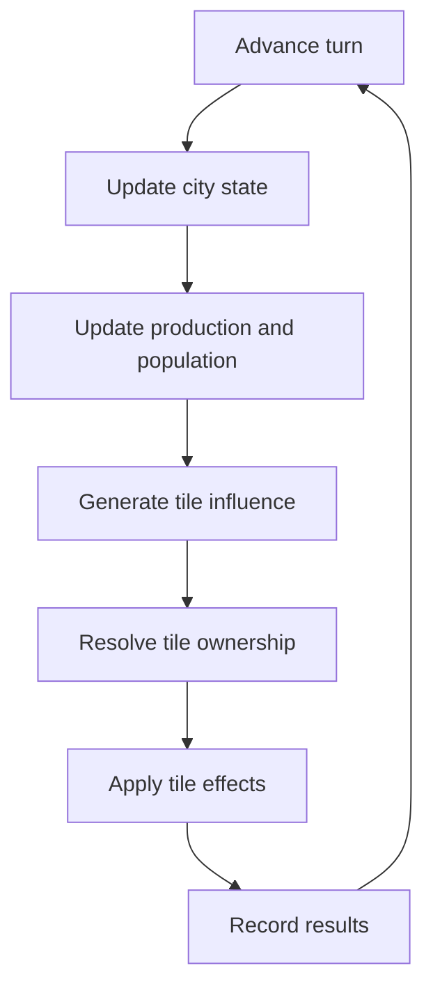

# Variables Overview

Last updated: 2026-06-13

This is the canonical relationship map for game variables and includes the reusable dependency guidance retained from the imported docs.

## Current Game Flow

## Current Variable Groups

| Group | Stored values | Derived or updated values |
|---|---|---|
| Game | `turn`, `cities`, `tiles` | Next `GameState` after an action or turn |
| City | `name`, `size` | Future growth, output, and influence values |
| Tile | `id`, `terrain`, `influenceByCity` | `owner` |

## Current Relationships

| Source | Relationship | Result | Status |
|---|---|---|---|
| `createGame(cityName)` | Creates baseline state | Turn `0`, one city, one tile | Implemented |
| `City.size` + growth amount | `growCity()` adds amount | New `City.size` | Implemented |
| `Tile.influenceByCity` | `resolveTileOwner()` compares influence | `Tile.owner` | Implemented |
| `GameState.tiles` | `advanceTurn()` resolves every tile | Updated tiles | Implemented |
| `GameState.turn` | `advanceTurn()` adds `1` | Updated turn | Implemented |
| City state + tile distance | Influence generation rule | Tile influence values | Planned |
| Owned tiles + terrain | Tile effect rule | City output or options | Planned |
| Population + city state | Growth/production rules | Updated city state | Planned |

## Relationship Invariants

These reusable rules came from the older relationship-map template and remain useful:

- Keep dependency direction explicit. A derived value should have a clear source and calculation point.
- Keep stored values separate from values that can be recalculated safely.
- Update related state together when ownership exists in more than one place.
- Historical snapshots, if added later, must not drift when live state changes.
- External modifiers such as events or research should enter through named rules, not hidden UI side effects.
- UI surfaces explain or trigger relationships; they do not own simulation formulas.
- Add a variable only when its source, consumer, and update timing are understood.

## Tile Ownership

Current ownership invariants:

- Influence is stored on the tile.
- Ownership is derived from influence.
- A tile with no positive influence has no owner.
- The current code does not maintain a separate city-owned tile list.
- Before multiple cities become normal gameplay, define tie behavior and replace city-name identity with stable city ids.

## Planned City Expansion

This diagram describes the intended direction, not current implementation:

## Planned Main Loop

Each planned phase must be documented as implemented only after its code exists.

## Stored Versus Derived Guidance

| Prefer storing | Prefer deriving |
|---|---|
| Stable identity such as tile id | Tile owner from influence, if performance allows |
| Player decisions that cannot be reconstructed | Totals produced entirely from other current values |
| State needed to resume a game | UI labels and presentation values |
| Historical snapshots intentionally frozen in time | Temporary comparisons and previews |

If a derived value is also stored for performance, document when and how it is refreshed.

## Implementation Checkpoints

When adding a mechanic or variable group:

1. Define its vocabulary in `docs/CONTEXT.md`.
2. Identify stored inputs, derived outputs, and update timing.
3. Add its relationship to this document.
4. Keep the calculation in domain code, not UI code.
5. Add focused tests once automated testing exists.
6. Update `docs/PROJECT_INFO.md` if ownership or file locations change.

## Related Docs

- [Project context](CONTEXT.md)
- [City design](city.md)
- [Tile design](tiles.md)
- [Project information](PROJECT_INFO.md)
