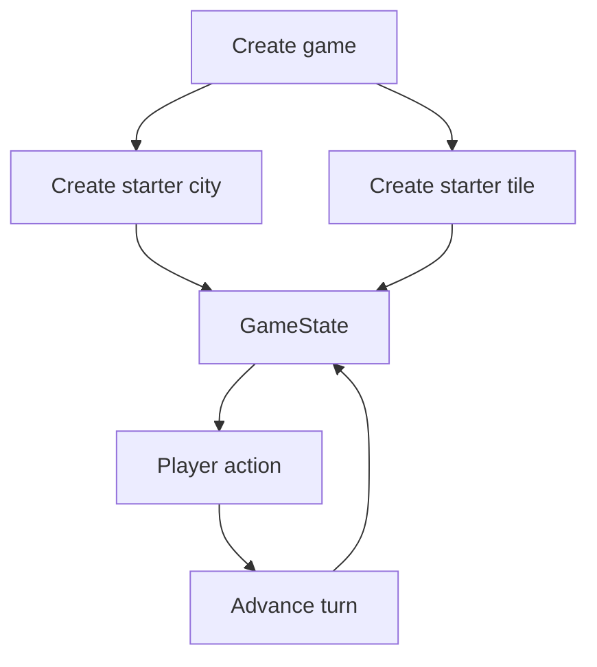
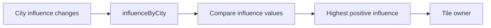
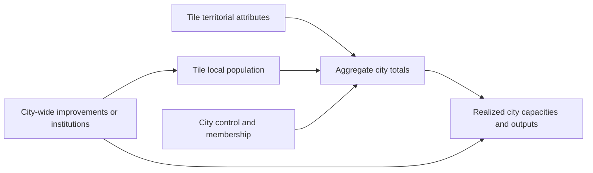
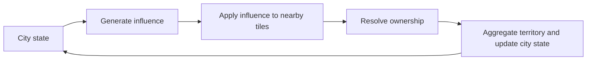
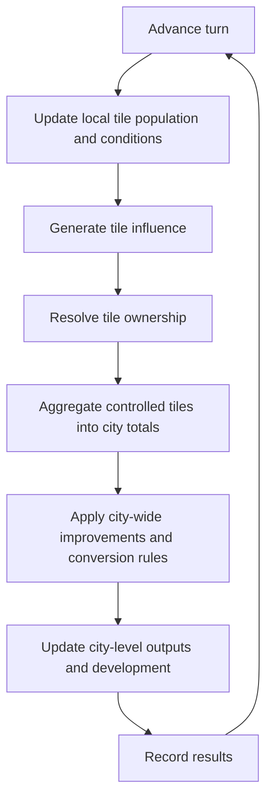

# Variables Overview

Last updated: 2026-06-13

This is the canonical relationship map for game variables and includes the reusable dependency guidance retained from the imported docs.

## Document Purpose

Use this file for:

- stored versus derived decisions
- dependency direction between systems
- turn/update flow
- relationship diagrams across city, tile, and game state

Do not use this file as the main place for vocabulary definitions or detailed per-domain mechanic writeups.

## Current Game Flow

## Current Variable Groups

| Group | Stored values | Derived or updated values |
|---|---|---|
| Game | `turn`, `civilizations`, `cities`, `tiles` | Next `GameState` after a turn |
| City | `id`, `civilizationId`, `name` | Size, population, and arable land totals |
| Tile | `id`, `ownerCityId`, `localPopulation`, `arableLand` | Contribution to city totals |

## Planned Variable Groups

These are not implemented yet, but they are now part of the active design direction.

| Group | Planned stored values | Planned derived or updated values |
|---|---|---|
| City | stable `id`, display `name`, city-wide improvements or institutions, optional aggregate caches | size, total population, territorial capacity, realized outputs, city-wide modifiers |
| Tile | territorial attributes, local population, later local improvements or conditions | local growth changes, local realized effects, contribution to city totals |

## Current Relationships

| Source | Relationship | Result | Status |
|---|---|---|---|
| `createGame(cityName)` | Creates baseline state | Turn `0`, one civilization, one city, one owned tile | Implemented |
| Tiles owned by city id | `getCityTotals()` aggregates values | City size, population, and arable land | Implemented |
| `GameState.turn` | `advanceTurn()` adds `1` | Updated turn | Implemented |
| City state + tile distance | Influence generation rule | Tile influence values | Planned |
| Tiles owned by city id | Count controlled tiles | City size | Planned |
| Controlled tiles | Aggregate tile attributes and population | City territorial totals | Planned |
| Tile territorial attributes + city systems | Conversion rules | Realized city outputs | Planned |
| Tile population + local conditions | Local population change rules | Updated tile population | Planned |
| City membership + city-wide improvements | Shared modifiers on controlled tiles | Adjusted tile and city growth/output | Planned |
| Population + territory + city systems | Growth and development rules | Updated city state | Planned |

## Relationship Invariants

These reusable rules came from the older relationship-map template and remain useful:

- Keep dependency direction explicit. A derived value should have a clear source and calculation point.
- Keep stored values separate from values that can be recalculated safely.
- Update related state together when ownership exists in more than one place.
- Historical snapshots, if added later, must not drift when live state changes.
- External modifiers such as events or research should enter through named rules, not hidden UI side effects.
- UI surfaces explain or trigger relationships; they do not own simulation formulas.
- Add a variable only when its source, consumer, and update timing are understood.

## Planned Influence Ownership

Current and planned ownership decisions:

- each city stores a stable id
- tile `ownerCityId` currently references a stable city id or `null`
- controlled tiles are derived from tile ownership rather than stored on the city
- the starter tile begins owned by the starter city so every created city has at least one tile
- influence-based ownership and tie behavior remain unresolved

## Planned City Aggregation

This diagram describes the intended direction, not current implementation:

This section owns the cross-system relationship, not the detailed definition of `City` or `Tile`.

Derived city totals include:

- `size`: number of controlled tiles
- `population`: sum of controlled tiles' `localPopulation`
- territorial totals: sums of each controlled tile attribute

## Implemented First Slice

The first slice proves direct city ownership and aggregation with one territorial attribute:

- one civilization, one city, and one owned starter tile
- tile-level integer population and arable land
- derived city size, population, and arable land

Population growth, institutions, influence, culture, and additional territorial attributes remain planned.

## Next Planned Slices

Keep these as future implementation targets, not current behavior:

1. Population growth on tiles
   Add local population change while keeping population as whole people.

2. One city-wide institution
   Add a minimal city-level modifier such as a hospital that affects all controlled tiles.

3. Additional territorial attributes
   Extend tiles beyond `arableLand` only when another attribute has a clear use in simulation or UI.

4. Influence and control resolution
   Add numeric tile influence, then resolve ownership from competing city and civilization presence.

5. Culture and territorial expansion
   Add culture accumulation and use it to expand projection range or unlock border growth.

6. Territory refinement
   Introduce `core territory` and `frontier territory` only when partial incorporation changes gameplay.

7. UI inspection surfaces
   Add a city screen and a tile inspection flow that can handle more than one tile without requiring a 2D map renderer yet.

The intended first UI direction is:

- a city detail surface that shows derived totals from controlled tiles
- placeholders for future city-wide systems such as improvements or institutions
- a tile list or tile selector that can handle multiple tiles
- a tile detail surface that shows all current territorial attributes for the selected tile

This should stay separate from map rendering. The first UI only needs to support inspecting many tiles, not drawing a full spatial grid.

## Planned Influence Expansion

This diagram describes the intended direction, not current implementation:

## Planned Main Loop

Each planned phase must be documented as implemented only after its code exists.

## Stored Versus Derived Guidance

| Prefer storing | Prefer deriving |
|---|---|
| Stable identity such as tile id | Tile owner from influence, if performance allows |
| Local tile population and territorial attributes | City size, population, and territorial totals from controlled tiles |
| Player decisions that cannot be reconstructed | Totals produced entirely from other current values |
| State needed to resume a game | UI labels and presentation values |
| City-wide improvements or institutions | Realized outputs from territory plus modifiers |
| Historical snapshots intentionally frozen in time | Temporary comparisons and previews |

If a derived value is also stored for performance, document when and how it is refreshed.

## Implementation Checkpoints

When adding a mechanic or variable group:

1. Define its vocabulary in `docs/CONTEXT.md`.
2. Identify stored inputs, derived outputs, and update timing.
3. Add its relationship to this document.
4. Keep the calculation in domain code, not UI code.
5. Add focused tests once automated testing exists.
6. Update `docs/PROJECT_INFO.md` if ownership or file locations change.

## Related Docs

- [Project context](CONTEXT.md)
- [City design](city.md)
- [Tile design](tiles.md)
- [City growth and territory brainstorm](brainstorm-city-growth-2026-06-13.md)
- [Project information](PROJECT_INFO.md)
