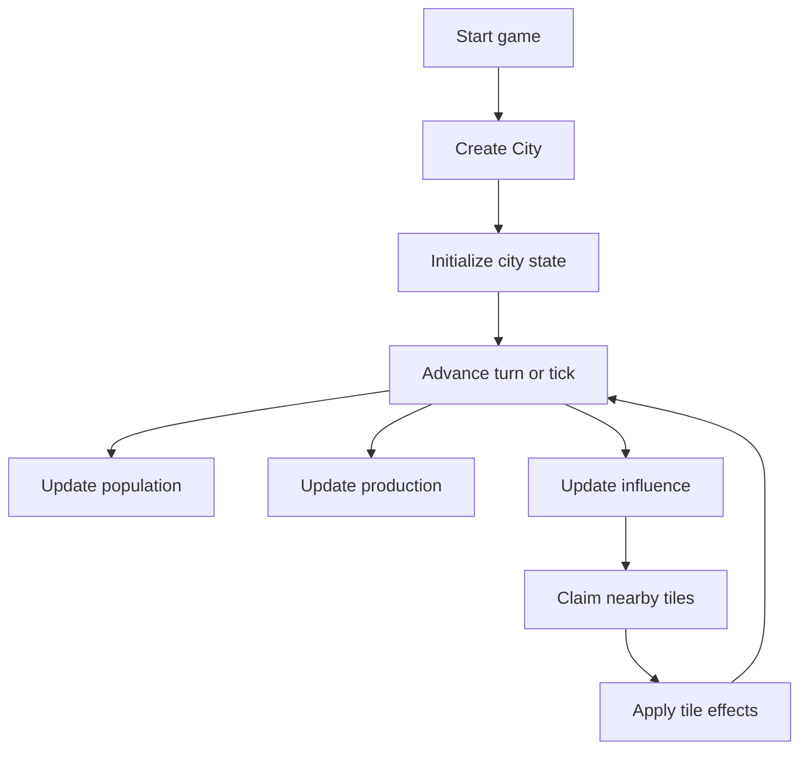
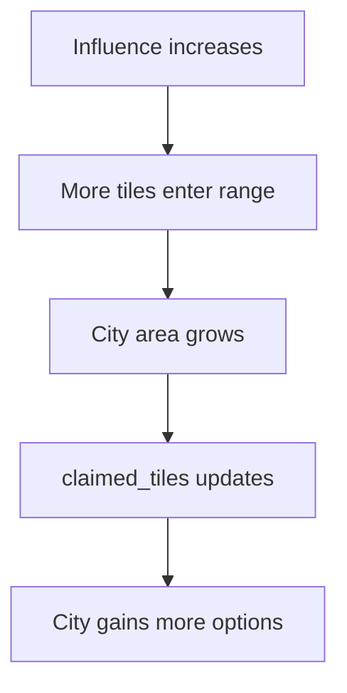
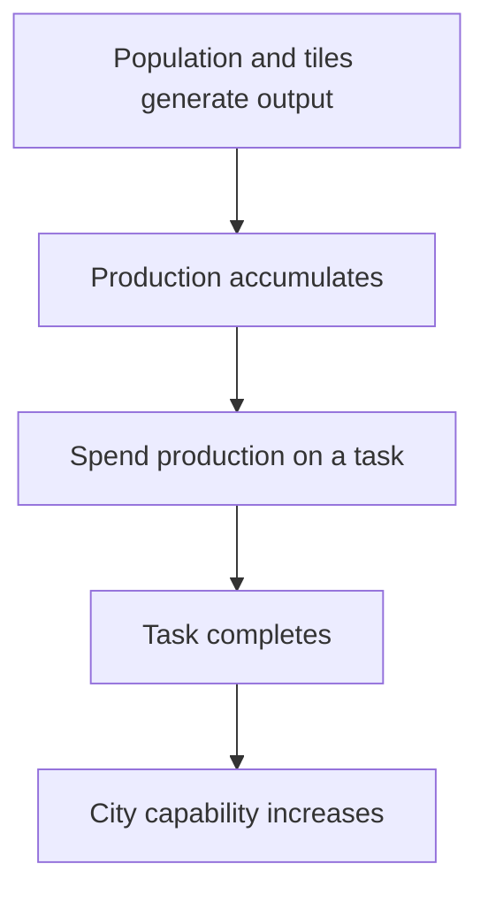

# Variables Overview

## Main Game Flow
1. Start a game.
2. Create the first `City`.
3. Initialize the city state.
4. Advance a turn or tick.
5. Update population, production, and influence.
6. Expand city control to nearby tiles.
7. Claim tiles inside city area.
8. Apply tile effects.
9. Repeat.

## Core Variables

| Variable | Role |
| --- | --- |
| `city` | Main game object and state container. |
| `population` | Drives growth and output. |
| `production` | Used for build progress and city development. |
| `influence` | Defines how far the city reaches. |
| `claimed_tiles` | Tiles currently inside city area. |
| `tile_state` | Ownership and use state for each tile. |
| `turn_count` | Tracks progression through time. |

## Major Mechanics

### City Expansion

### Production Loop

