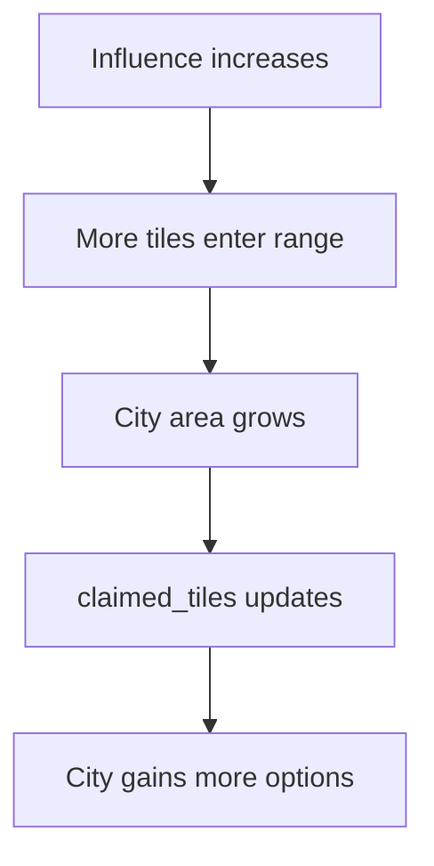
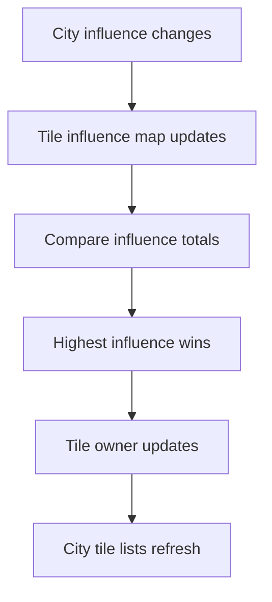
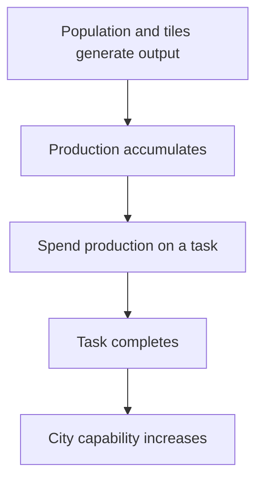

# Variables Overview

## Main Game Flow
4. Advance a turn or tick.
5. Update city population, production, and influence.
6. Recalculate tile influence from nearby cities.
7. Resolve tile ownership.
8. Apply tile effects.
9. Repeat.

```mermaid
flowchart TD  B --> C[Create map tiles]
  C --> D[Initialize city state]
  D --> E[Advance turn or tick]
  E --> F[Update population]
  E --> G[Update production]
  E --> H[Update influence]
  H --> I[Recalculate tile influence]
  I --> J[Resolve tile ownership]
  J --> K[Apply tile effects]
  K --> E
```

## Core Variables

| Variable | Role |
| --- | --- |
| `city` | Main game object and state container. |
| `population` | Drives growth and output. |
| `production` | Used for build progress and city development. |
| `influence` | Defines how far the city reaches. |
| `claimed_tiles` | Tiles currently inside city area. |
| `tile_state` | Ownership and use state for each tile. |
| `terrain` | Base tile type. |
| `influenceByCity` | Influence values from each city on a tile. |
| `turn_count` | Tracks progression through time. |

## Major Mechanics

### City Expansion



### Tile Ownership



### Production Loop


